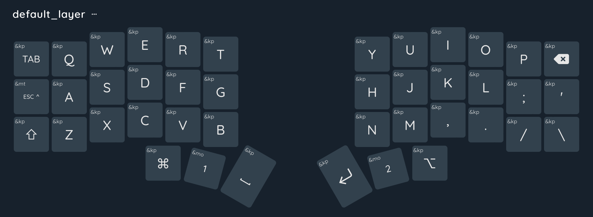
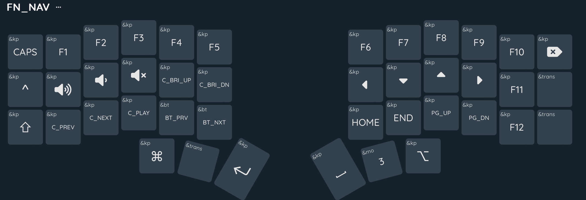
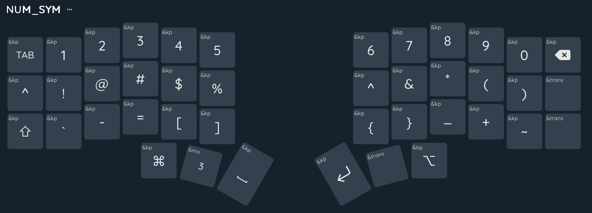
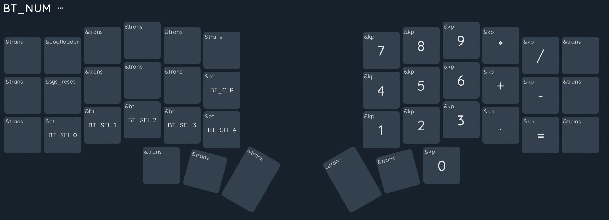

# zmk-config

My split keyboards.

| Keyboard | Layout | Keys (Size) |
| -------- | ------ | ----------- |
| Sofle    | 6x4+5  | 58 (60%)    |
| Corne    | 6x3+3  | 42 (40%)    |
| Sweep    | 5x3+2  | 34 (30%)    |

## My Corne Layout

Layer 0 --- Base (Default Layer)

Layer 1 --- Function & Navigation

Layer 2 --- Numbers & Symbols

Layer 3 --- Bluetooth & Numbers

## Hold-Tap & Tap-Dance

**Hold-tap/Mod-tap**: Tap for key1, hold for key2.

**Tap-Dance**: tap for key1, double tap for key2, tripple tap for key3, etc.

The above functions can be nested. Actually in vial, the tap-dance can be
configured in four ways: tap, hold, double tap, tap+hold.

Tapping term: 200ms, 150-200ms delay for me is okay, but YMMV.

> For a 3x6 corne, only one hold-tap needs to be set, which is Esc/Ctrl.
> Combos for Esc is also an option, inside vim you can use `C-[` as Esc.
> For the sweep (34 keys), many more are used (homerow mods + layer-tap).
> The idea of Hold-Tap behavior and Homerow mods is awesome, but in
> practice, it requires finicky timing. Check
> [urob](https://github.com/urob/zmk-config) for timeless homerow mods.
> BTW, I use ACGS as home row mods for MacOS.

| Tap  | Hold   |
| ---- | ------ |
| Esc  | LCtrl  |
| A    | LAlt   |
| S    | LCtrl  |
| D    | LGui   |
| F    | LShift |
| J    | RShift |
| K    | RGui   |
| L    | RCtrl  |
| ;    | RAlt   |
| Tab  | MO1    |
| BSPC | MO2    |

## Macros & Combos

| Macros | Definition |
| ------ | ---------- |
| M0     | C-Tab      |
| M1     | C-S-Tab    |
| M2     | C-SPC      |
| M3     | email      |
| M4     | mobile     |
| M5     | - [ ]      |

| Combos | Output |
| ------ | ------ |
| vb     | [      |
| nm     | ]      |
| fg     | {      |
| hj     | }      |
| rt     | (      |
| yu     | )      |
| qw     | Esc    |
| df     | M0     |
| as     | M1     |
| zx     | M2     |
| em     | M3     |
| mo     | M4     |
| gh     | M5     |

## Resources

- [My Sweep Config](https://github.com/yshenfab/zmk-sweep)
- [ZMK Docs](https://zmk.dev/docs)
- [urob](https://github.com/urob/zmk-config) -- Timeless homerow mods
- [Miryoku ZMK](https://github.com/manna-harbour/miryoku_zmk) -- 5x3+3, 36 keys
- [Keymap Editor](https://nickcoutsos.github.io/keymap-editor/)
