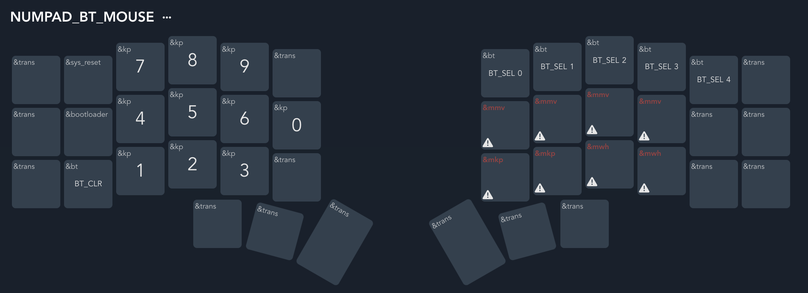
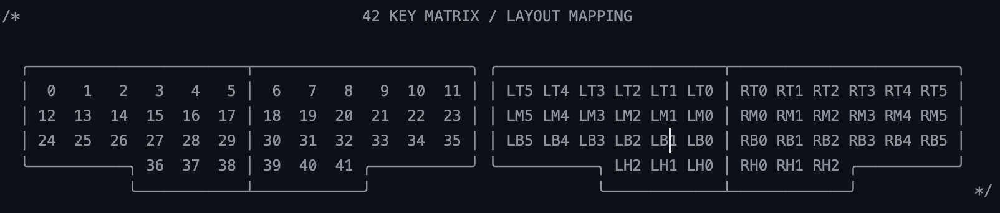

# zmk-config

## My split keyboards

| Keyboard | Layout | Keys (Size) |
| -------- | ------ | ----------- |
| sofle    | 6x4+5  | 58 (60%)    |
| corne    | 6x3+3  | 42 (40%)    |
| sweep    | 5x3+2  | 34 (30%)    |

The bat keyboard is a variant of [cocot46plus](https://github.com/aki27kbd/cocot46plus).

## My Corne Layout

Layer 0 --- Base (Default Layer)

Layer 1 --- Function & Navigation

Layer 2 --- Numbers & Symbols

Layer 3 --- Number Pad, Bluetooth & Mouse

The mouse emulations include mouse left/down/up/right, mouse left/right click, and
mouse scroll up/down.

Layer 4 for macros (not necessary).

## Hold-Tap

For a 6x3 corne, if you don't want too many hold-tap keys, only one hold-tap
needs to be set, for example, Ctrl/Esc on the first column of left hand.
I use hold-taps for homerow mods and layer-tap on thumb keys.

> The idea of hold-tap behavior and homerow mods is awesome, but in
> practice, it requires finicky timing. Check
> [urob](https://github.com/urob/zmk-config) for timer-less homerow mods.
> BTW, I prefer ACGS as homerow (MacOS + shortcuts), but YMMV.

| Hold   | Tap  |
| ------ | ---- |
| LCtrl  | Esc  |
| LAlt   | A    |
| LCtrl  | S    |
| LGui   | D    |
| LShift | F    |
| RShift | J    |
| RGui   | K    |
| RCtrl  | L    |
| RAlt   | ;    |
| LGui   | Esc  |
| MO1    | Tab  |
| MO2    | BSPC |
| MO4    | DEL  |

## Combos

ZMK use key positions for combos.
For a 6x3+3 corne, the 42 key matirx is defined as

Most combos are for symbols. I also use some combos for macros like todo, email,
etc.

| Combos | Output  | QWERTY keys |
| ------ | ------- | ----------- |
| 1 2    | Esc     | qw          |
| 4 5    | (       | rt          |
| 6 7    | )       | yu          |
| 16 17  | {       | fg          |
| 18 19  | }       | hj          |
| 28 29  | [       | vb          |
| 30 31  | ]       | nm          |
| 25 26  | `       | zx          |
| 26 27  | -       | xc          |
| 27 28  | \_      | cv          |
| 31 32  | =       | m,          |
| 32 33  | +       | ,.          |
| 33 34  | ~       | ./          |
| 13 14  | C-SPC   | as          |
| 14 15  | C-S-Tab | sd          |
| 15 16  | C-Tab   | df          |
| 5 9    | todo    | to          |
| 3 31   | email   | em          |

## Mouse

Since my keyboard doesn't have a trackball/trackpoint/touchpad/joystick, I have to
use keys for mouse emulation.
Check [urob's ZMK fork](https://github.com/urob/zmk) for mouse behaviors
like mkp (mouse keypress), mmv (mouse move), mwh (mouse wheel).

## Resources

- [ZMK Docs](https://zmk.dev/docs)
- [urob zmk-config](https://github.com/urob/zmk-config) -- Timer-less homerow mods
- [urob's ZMK fork](https://github.com/urob/zmk)
- [Miryoku ZMK](https://github.com/manna-harbour/miryoku_zmk)
- [My Sweep Config](https://github.com/yshenfab/zmk-sweep)
- [Keymap Editor](https://nickcoutsos.github.io/keymap-editor/)
