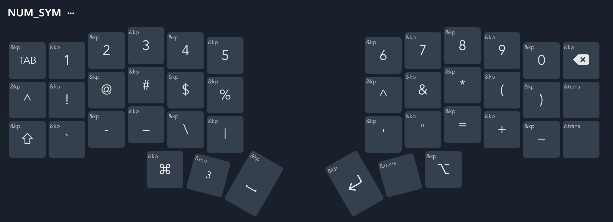

# zmk-config

My split keyboards.

| Keyboard | Layout | Keys (Size) |
| -------- | ------ | ----------- |
| sofle    | 6x4+5  | 58 (60%)    |
| corne    | 6x3+3  | 42 (40%)    |
| sweep    | 5x3+2  | 34 (30%)    |

The batman keyboard is a variant of [cocot46plus](https://github.com/aki27kbd/cocot46plus).

## My Corne Layout

Layer 0 --- Base (Default Layer)

Layer 1 --- Function & Navigation

Layer 2 --- Numbers & Symbols

Layer 3 --- Bluetooth & Number Pad

## Hold-Tap

For a 6x3 corne, if you don't want too many hold-tap keys, only one hold-tap
needs to be set, for example, Ctrl/Esc on the first column of left hand. For a
5x3 sweep, many more hold-taps are used (homerow mods + layer-tap on thumb keys).
I use almost the same keymaps for all my keyboards.

> The idea of hold-tap behavior and homerow mods is awesome, but in
> practice, it requires finicky timing. Check
> [urob](https://github.com/urob/zmk-config) for timeless homerow mods.
> BTW, I prefer ACGS as homerow (MacOS + shortcuts), but YMMV.

| Hold   | Tap  |
| ------ | ---- |
| LCtrl  | Esc  |
| LAlt   | A    |
| LCtrl  | S    |
| LGui   | D    |
| LShift | F    |
| RShift | J    |
| RGui   | K    |
| RCtrl  | L    |
| RAlt   | ;    |
| LGui   | Esc  |
| MO1    | Tab  |
| MO2    | BSPC |
| LAlt   | DEL  |

## Macros & Combos

| Macros | Definition           |
| ------ | -------------------- |
| email  | <yshenfab@gmail.com> |
| todo   | - [ ]                |
| mobile | my number            |

| Combos | Output  |
| ------ | ------- |
| qw     | Esc     |
| vb     | [       |
| nm     | ]       |
| fg     | {       |
| hj     | }       |
| rt     | (       |
| yu     | )       |
| xc     | -       |
| cv     | \_      |
| m,     | =       |
| ,.     | +       |
| df     | C-Tab   |
| as     | C-S-Tab |
| zx     | C-SPC   |
| em     | email   |
| gh     | todo    |
| mo     | mobile  |

## Resources

- [My Sweep Config](https://github.com/yshenfab/zmk-sweep)
- [ZMK Docs](https://zmk.dev/docs)
- [urob](https://github.com/urob/zmk-config) -- Timeless homerow mods
- [Miryoku ZMK](https://github.com/manna-harbour/miryoku_zmk) -- 5x3+3, 36 keys
- [Keymap Editor](https://nickcoutsos.github.io/keymap-editor/)
